# 📱 Screen Mirror

**WebRTC tabanlı, gerçek zamanlı Android ekran paylaşımı uygulaması.**

Screen Mirror; bir cihazın ekranını tek bir oda adı üzerinden, düşük gecikmeyle sınırsız sayıda izleyiciye canlı olarak yayınlayan açık kaynaklı bir Android uygulamasıdır. Medya akışı WebRTC ile uçtan uca kurulur; sinyalleşme ise güvenli WebSocket (`wss://`) kanalı üzerinden yapılır.

-green)


[](https://github.com/Memati8383/ScreenShareApp/pulls)

---

## 🆚 Neden Screen Mirror?

| | **Screen Mirror** | TeamViewer / AnyDesk |
|---|---|---|
| Hesap / kayıt | ❌ Gerekmez — tek oda kodu yeter | ✅ Hesap veya lisans gerekir |
| Fiyat | 🆓 Tamamen ücretsiz ve açık kaynak | 💰 Ticari kullanımda ücretli |
| Gecikme | ⚡ WebRTC ile milisaniyeler | Değişken |
| Kurulum | 📦 Kurulumsuz izleme (tek kod) | Karşı tarafta da uygulama gerekir |
| Şeffaflık | 🔍 Kaynak kodu açık (MIT) | Kapalı kaynak |
| Veri | 🔒 Veri cihazınızda kalır | Üçüncü taraf sunucular |

> Screen Mirror uzaktan kontrol (klavye/fare) değil, **tek yönlü ekran yayını** odaklıdır: sunum, eğitim, oyun yayını ve uzaktan yardım senaryoları için idealdir.

---

## ✨ Özellikler

### 📡 Yayın (Host)
- **Anlık ekran yayını** — MediaProjection + WebRTC ile HD kalitede gerçek zamanlı yayın
- **Otomatik oda kodu** — `XXX-XXX` formatında, kolayca okunup paylaşılabilecek rastgele kod üretimi
- **Çoklu izleyici** — Tek yayına aynı anda sınırsız izleyici bağlanabilir
- **Yayın dondurma** — Tek dokunuşla yayını duraklat / devam ettir
- **Kalite değiştirme** — Yayın sırasında 480p / 720p / 1080p / 1440p ve 15 / 24 / 30 / 60 FPS arasında geçiş
- **Yayın kaydı** — H.264 kodlamalı MP4 formatında yerel kayıt

### 👁 İzleme (Viewer)
- **Tek oda adı ile bağlantı** — Aynı odayı girerek anında izleme
- **Ekran görüntüsü alma** — Yayının anlık görüntüsünü galeriye kaydetme
- **Tam ekran modu** — Kesintisiz izleme deneyimi

### 🔗 Bağlantı ve Güvenilirlik
- **Otomatik yeniden bağlanma** — Üstel geri çekilme (exponential backoff) ile 20 denemeye kadar
- **Heartbeat mekanizması** — Ping/Pong ile bağlantı sağlığı takibi
- **ICE aday kuyruğu** — Remote description gelmeden gelen ICE adayları güvenle bekletilir
- **Şifreli iletişim** — Sinyalleşme WSS (TLS) üzerinden, TURN kimlik bilgileri Android KeyStore ile AES-256/GCM şifreli

### 📊 Profil ve İstatistikler
- **Profil yönetimi** — Takma ad ve profil fotoğrafı (kamera / galeri)
- **Haftalık aktivite grafiği** — Kullanım istatistiklerinin görselleştirilmesi
- **Bağlantı zaman çizelgesi** — Oturum geçmişinin kronolojik görünümü
- **Bağlantı kalitesi göstergesi** — RTT, paket kaybı ve FPS değerlerine göre İYİ / ORTA / KÖTÜ puanlama
- **Oda geçmişi** — Son 50 oturum; rol, süre ve katılımcı sayısı ile birlikte

### 🎨 Kullanıcı Deneyimi
- **Çift dil desteği** — Türkçe ve İngilizce (uygulama içinden anında geçiş)
- **Lottie animasyonları** — Bağlanma, canlı yayın, hata ve başarı ekranlarında akıcı animasyonlar
- **Haptik geri bildirim** — Dokunmatik titreşim desteği (ayarlardan kapatılabilir)
- **Material Design 3** — Modern, karanlık temalı arayüz

---

## 📸 Ekran Görüntüleri

<table>
  <tr>
    <td align="center">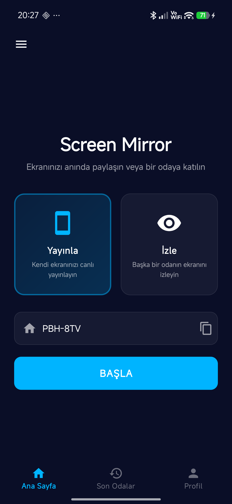<br><b>Ana Ekran (Yayınla)</b></td>
    <td align="center">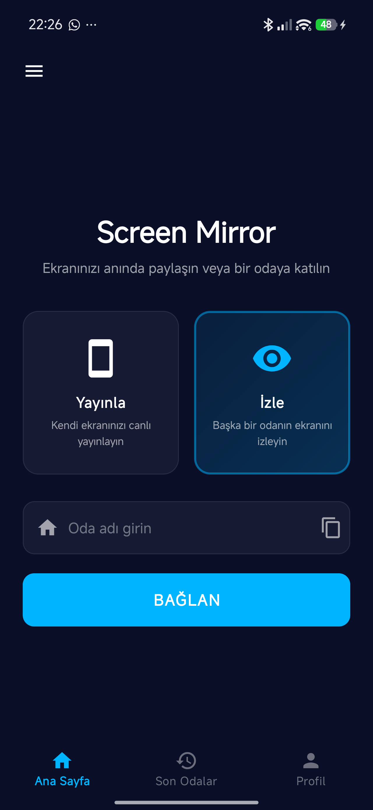<br><b>Ana Ekran (İzle)</b></td>
  </tr>
  <tr>
    <td align="center">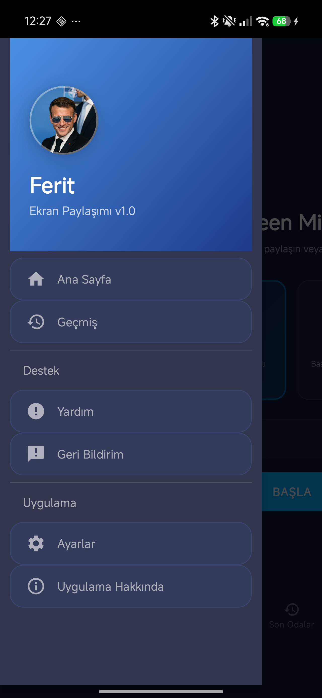<br><b>Drawer Menü</b></td>
    <td align="center">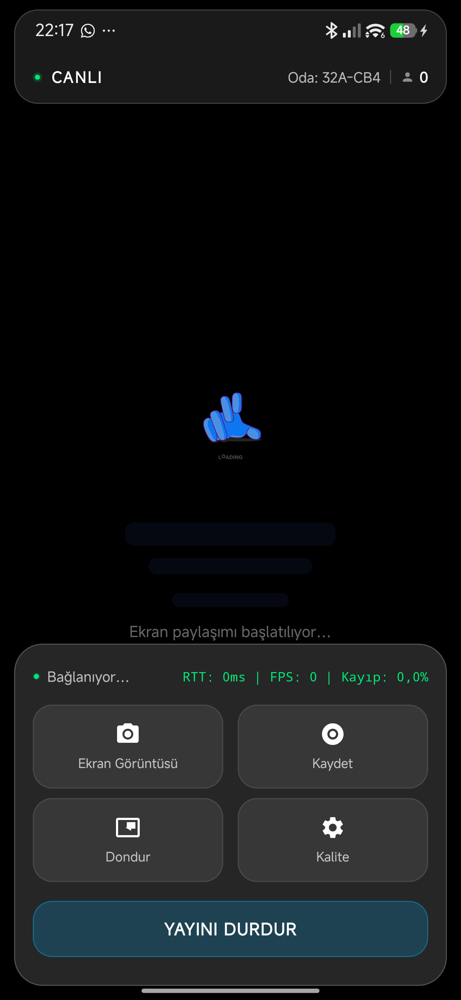<br><b>Yayın (Host)</b></td>
    <td align="center">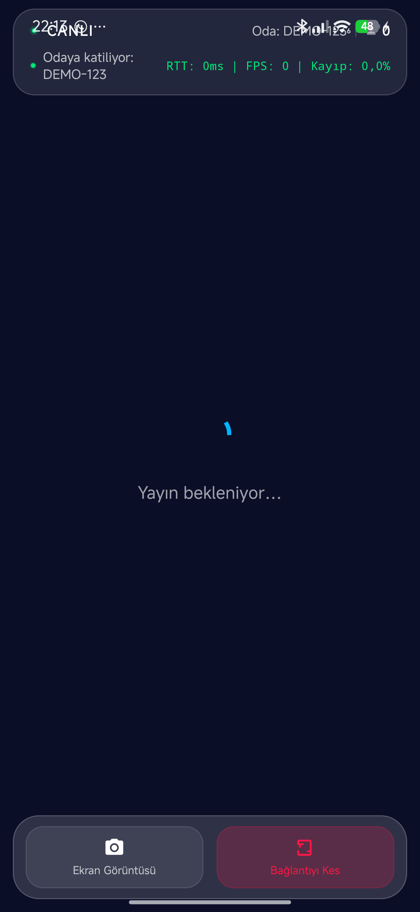<br><b>İzleme (Viewer)</b></td>
    <td align="center">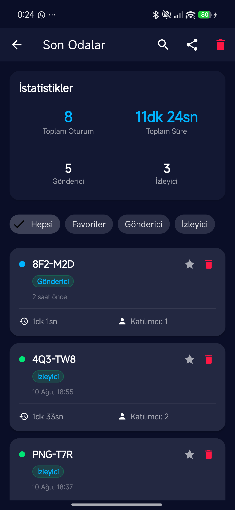<br><b>Son Odalar (Yeni)</b></td>
  </tr>
  <tr>
    <td align="center">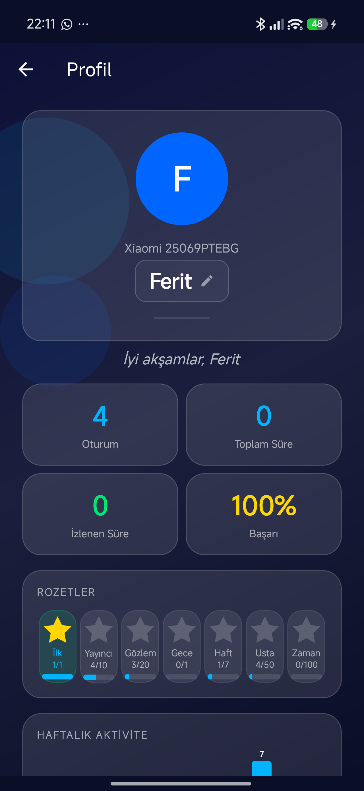<br><b>Profil & İstatistik</b></td>
    <td align="center">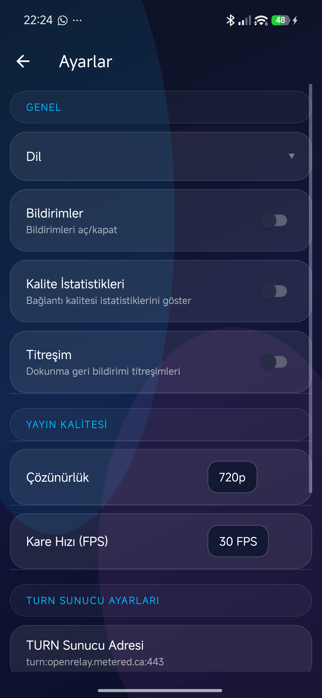<br><b>Ayarlar</b></td>
    <td align="center">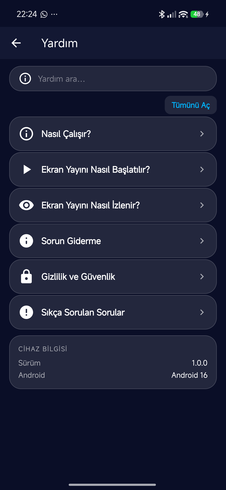<br><b>Yardım</b></td>
    <td align="center">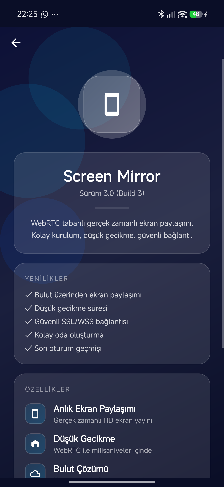<br><b>Uygulama Hakkında</b></td>
  </tr>
  <tr>
    <td align="center">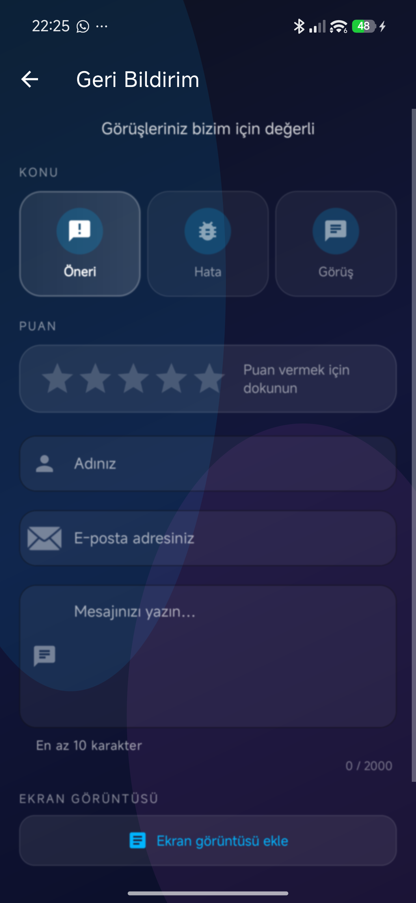<br><b>Geri Bildirim</b></td>
  </tr>
</table>

---

## 📊 İnternet Kullanımı (Tahmini)

Aşağıdaki tablo, her çözünürlük ve FPS ayarında **yaklaşık ne kadar internet harcanacağını** gösterir. Değerler, uygulamanın video kodlayıcısının hedef bit hızı formülüne dayanır:

> `hedef bit hızı = genişlik × yükseklik × 3` bit/sn  &nbsp;*(kaynak: `ScreenShareService.kt`)*

Bu formül çözünürlüğe göre sabitlendiği için **tüketim büyük ölçüde çözünürlük tarafından belirlenir**; FPS'in etkisi sınırlıdır (kodlayıcı aynı hedef bit hızını kullanır, daha yüksek FPS daha akıcı görüntü verir ama veri miktarını belirgin şekilde artırmaz). Tablodaki rakamlar, **sürekli değişen bir ekran** (video, kayan pencereler vb.) için geçerlidir; durağan bir ekran çok daha az veri kullanır.

**Ölçü birimi:** MB / saat (yaklaşık GB / saat parantez içinde).

| Çözünürlük | 15 FPS | 24 FPS | 30 FPS | 60 FPS |
|---|---|---|---|---|
| **480p** (854×480) | ~538 MB/sa (0.53 GB) | ~580 MB/sa (0.57 GB) | ~598 MB/sa (0.58 GB) | ~748 MB/sa (0.73 GB) |
| **720p** (1280×720) | ~1209 MB/sa (1.18 GB) | ~1303 MB/sa (1.27 GB) | ~1343 MB/sa (1.31 GB) | ~1679 MB/sa (1.64 GB) |
| **1080p** (1920×1080) | ~2721 MB/sa (2.66 GB) | ~2932 MB/sa (2.86 GB) | ~3023 MB/sa (2.95 GB) | ~3779 MB/sa (3.69 GB) |
| **1440p** (2560×1440) | ~4838 MB/sa (4.72 GB) | ~5214 MB/sa (5.09 GB) | ~5375 MB/sa (5.25 GB) | ~6719 MB/sa (6.56 GB) |

**Yaklaşık hedef bit hızları (encoder):** 480p ≈ 1.23, 720p ≈ 2.76, 1080p ≈ 6.22, 1440p ≈ 11.06 Mbps (formülden hesaplanmıştır; protokol yükü ile birlikte saatlik tüketim yukarıdaki tablodadır).

> ℹ️ Bu değerler **tahminidir** (gerçek ölçüm değil). Gerçek tüketim; yayınlanan içeriğin hareketliliğine, ağ kalitesine ve TURN sunucusu yüküne göre değişir. Durağan bir ekran söz konusu olduğunda tüketim hedef bit hızının çok altına düşebilir.

---

## 🛠 Teknolojiler

| Kütüphane | Sürüm | Kullanım Amacı |
|---|---|---|
| [Stream WebRTC](https://github.com/GetStream/stream-webrtc-android) | `1.3.10` | Gerçek zamanlı video akışı (WebRTC) |
| OkHttp | `4.12.0` | WebSocket sinyalleşme |
| Material Components | `1.12.0` | UI bileşenleri |
| Gson | `2.11.0` | JSON serileştirme |
| Lottie | `6.6.2` | Animasyonlar |
| Coroutines | `1.8.1` | Asenkron işlemler |
| Lifecycle (ViewModel) | `2.8.6` | Yaşam döngüsü yönetimi |
| AndroidX Preference | `1.2.1` | Ayarlar ekranı |

**Geliştirme ortamı:** Kotlin · Android Gradle Plugin 9.2.1 · `compileSdk 37` · JDK 17 · ViewBinding

---

## 🏗 Mimari

Uygulama, tek bir **foreground servis** etrafında şekillenen olay tabanlı (event-driven) bir mimari kullanır:

```
┌────────────────────┐         WSS (TLS)          ┌──────────────────────┐
│  SenderActivity    │◄──── sinyalleşme ─────────►│                      │
│  ViewerActivity    │      register/roster/       │  wss://wss.getlost.  │
└────────┬───────────┘      desc/ice/ping          │  ovh signaling sunucu│
         │ bind                                    └──────────────────────┘
┌────────▼───────────┐
│ ScreenShareService │  (foreground, mediaProjection|dataSync)
│  ├─ VideoCaptureMgr│  MediaProjection → WebRTC video track
│  ├─ PeerConnection │  SDP offer/answer + ICE
│  ├─ MediaRecorder  │  H.264 / MP4 yayın kaydı
│  └─ ServiceState   │  sealed class ServiceEvent → UI durum güncellemeleri
│     Manager        │
└────────────────────┘
```

- **`ScreenShareService`** — WebRTC kurulumu, ekran yakalama, kayıt ve yayını yöneten foreground servis. Tüm durum değişiklikleri `ServiceEvent` sealed class'ı üzerinden aktivitelere iletilir.
- **`CloudSignalingClient`** — OkHttp WebSocket istemcisi. `register`, `roster`, `desc` (SDP), `ice` ve `ping/pong` mesajlarını yönetir; kopma durumunda üstel backoff ile yeniden bağlanır.
- **`VideoCaptureManager`** — `ScreenCapturerAndroid` ile ekran yakalama; yayın sırasında çözünürlük/FPS değişikliği ve dondurma.
- **`ServiceStateManager`** — Servis durumunu tek noktadan yönetir, servis/aktivite yaşam döngüsü kopmalarına karşı dayanıklılık sağlar.
- **`SecureCredentialStore`** — TURN kimlik bilgilerini Android KeyStore'da üretilen AES-256/GCM anahtarıyla şifreleyerek saklar.

### Bağlantı Akışı

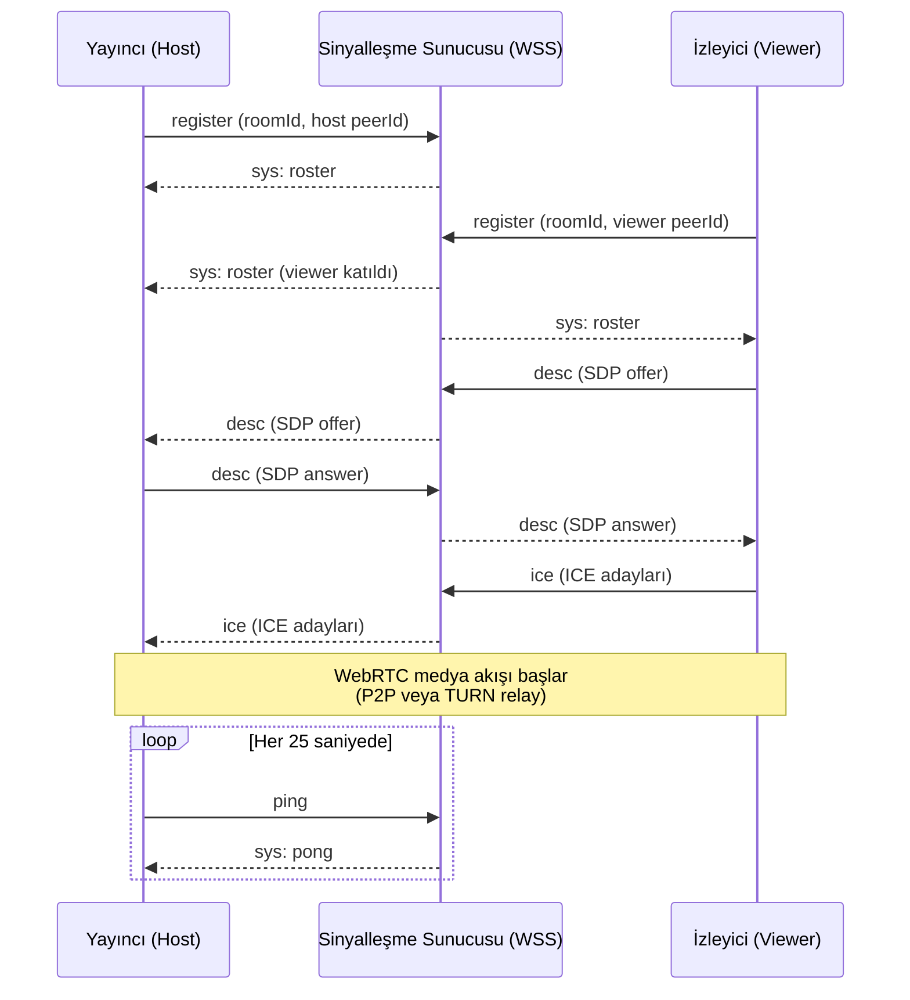

---

## 📁 Proje Yapısı

```
app/src/main/java/com/example/screenmirror/
├── SplashActivity.kt            # Açılış ekranı
├── MainActivity.kt              # Ana ekran (Yayınla / İzle, oda girişi)
├── SenderActivity.kt            # Yayın ekranı (dondur, kayıt, kalite)
├── ViewerActivity.kt            # İzleme ekranı (tam ekran, ekran görüntüsü)
├── RecentActivity.kt            # Son oturumlar listesi
├── ProfileActivity.kt           # Profil + kullanım istatistikleri
├── SettingsActivity.kt          # Ayarlar konteyneri
├── SettingsFragment.kt          # Dil, çözünürlük, FPS, TURN, haptik ayarları
├── HelpActivity.kt              # Yardım / SSS
├── AboutActivity.kt             # Hakkında
├── FeedbackActivity.kt          # Geri bildirim formu
├── ScreenShareService.kt        # WebRTC + yakalama + kayıt foreground servisi
├── CloudSignalingClient.kt      # WebSocket sinyalleşme istemcisi
├── ScreenMirrorApp.kt           # Application sınıfı
├── AppSettings.kt               # Merkezi ayar yönetimi
├── SecureCredentialStore.kt     # AES/GCM şifreli TURN kimlik bilgileri
├── HapticHelper.kt              # Titreşim geri bildirimi
├── NotificationHelper.kt        # Bildirim kanalları
├── SkeletonAnimHelper.kt        # Skeleton yükleme animasyonları
├── SpinnerPreference.kt         # Özel spinner tercih bileşeni
├── ScreenshotAdapter.kt         # Yayın görüntüsü yakalama adaptörü
├── ScreenshotHelper.kt          # Ekran görüntüsü kaydetme
├── ConnectionTimelineView.kt    # Bağlantı zaman çizelgesi (özel view)
├── WeeklyActivityView.kt        # Haftalık aktivite grafiği (özel view)
├── capture/
│   └── VideoCaptureManager.kt   # MediaProjection yakalama yönetimi
├── data/
│   ├── RoomHistory.kt           # Oda oturum veri modeli
│   └── RoomHistoryManager.kt    # Oda geçmişi (SharedPreferences, max 50)
├── model/
│   ├── ConnectionQuality.kt     # Bağlantı kalitesi (İYİ/ORTA/KÖTÜ)
│   ├── ErrorType.kt             # Hata türleri
│   ├── RoomRole.kt              # Rol (yayıncı / izleyici)
│   └── ServiceEvent.kt          # Servis olayları (sealed class)
└── service/
    └── ServiceStateManager.kt   # Servis durum yöneticisi
```

---

## 📋 Gereksinimler

**Çalıştırma:**
- Android 8.0+ (API 26)
- İnternet bağlantısı
- Ekran paylaşımı izni (sistem onay penceresi)

**Geliştirme:**
- Android Studio (güncel sürüm — AGP 9.2.1 gerektirir)
- JDK 17

---

## 🚀 Kurulum

1. Repoyu klonlayın:
```bash
git clone https://github.com/Memati8383/ScreenShareApp.git
cd ScreenShareApp
```

2. Projeyi **Android Studio** ile açın.

3. Gradle senkronizasyonunun tamamlanmasını bekleyin.

4. Fiziksel bir cihaz veya emülatör seçip ▶ **Run** ile çalıştırın.

> 💡 Release APK oluştururken ProGuard küçültmesi (`isMinifyEnabled` + `isShrinkResources`) otomatik olarak uygulanır.

---

## 🔑 İzinler

| İzin | Kullanım Amacı |
|---|---|
| `INTERNET` | WebRTC akışı ve sinyalleşme |
| `ACCESS_NETWORK_STATE` / `ACCESS_WIFI_STATE` | Bağlantı durumu ve kalite takibi |
| `FOREGROUND_SERVICE` / `FOREGROUND_SERVICE_MEDIA_PROJECTION` / `FOREGROUND_SERVICE_DATA_SYNC` | Yayın sırasında ekran yakalamanın arka planda kesintisiz sürmesi |
| `POST_NOTIFICATIONS` | Yayın/kayıt durumu bildirimleri |
| `VIBRATE` | Haptik (titreşim) geri bildirimi |
| `CAMERA` | Profil fotoğrafı çekimi |
| `READ_MEDIA_VIDEO` / `READ`·`WRITE_EXTERNAL_STORAGE` (eski sürümler) | Kayıt videoları ve ekran görüntülerinin kaydedilmesi |

> Uygulama **ekran içeriğine** yalnızca her oturumda sistem onay penceresi (`MediaProjection`) üzerinden erişir; kayıt onayı olmadan ekran yakalama başlamaz.

---

## 🔧 Kullanım

### Yayın Başlatma (Host)
1. Ana ekranda **Yayınla** modunu seçin — otomatik oda kodu (`ABC-123` formatında) oluşturulur.
2. Oda kodunu izleyicilerle paylaşın (kopyalama butonu ile).
3. **YAYINLA** butonuna dokunun ve sistem ekran paylaşımı iznini onaylayın.
4. Yayın sırasında alt bardan **dondur**, **kayıt** ve **kalite** kontrollerini kullanabilirsiniz.

### Yayın İzleme (Viewer)
1. Ana ekranda **İzle** modunu seçin.
2. Yayıncının paylaştığı oda kodunu girin.
3. **BAĞLAN** butonuna dokunun.
4. Yayını izleyin; ekran görüntüsü alabilir veya tam ekrana geçebilirsiniz.
5. Birden fazla izleyici aynı anda aynı odaya bağlanabilir.

---

## ❓ SSS & Sorun Giderme

**Bağlanamıyorum veya "Sunucu yanıt vermiyor" hatası alıyorum.**
Sinyalleşme bağlantısı 10 saniye içinde oda listesi (roster) alamazsa kendini kapatır ve üstel gecikmeyle 20 denemeye kadar yeniden bağlanır. İnternet bağlantınızı kontrol edin ve birkaç saniye bekleyin; uygulama otomatik olarak tekrar deneyecektir.

**İzleyici bağlanıyor ama görüntü gelmiyor.**
Bazı ağlarda (özellikle kısıtlı kurumsal/okul ağları) doğrudan P2P bağlantı kurulamaz. Ayarlar bölümünden kendi TURN sunucunuzu yapılandırın; akış TURN relay üzerinden taşınacaktır.

**Görüntü donuyor veya gecikme artıyor.**
Bağlantı kalitesi göstergesi KÖTÜ ise ayarlardan çözünürlüğü (örn. 720p → 480p) ve kare hızını (örn. 30 → 15 FPS) düşürün.

**Her yayında neden tekrar ekran kaydı izni isteniyor?**
Bu, Android'in `MediaProjection` güvenlik gereksinimidir; her yeni ekran yakalama oturumu için sistem onayı zorunludur. Uygulama bu izni kalıcı olarak saklayamaz.

**Oda kodunu neden yayıncı belirleyemiyor?**
Yayıncı tarafında `XXX-XXX` formatında çakışması neredeyse imkânsız, okunması ve paylaşılması kolay bir kod otomatik üretilir. İzleyici modunda ise kod serbestçe girilebilir.

**Aynı yayına kaç kişi bağlanabilir?**
Oda bazlı roster mekanizması sınırsız izleyiciyi destekler; izleyici sayısı gerçek zamanlı olarak yayıncıya iletilir.

**Kayıtlar ve ekran görüntüleri nereye kaydediliyor?**
Yayın kayıtları MP4 (H.264), ekran görüntüleri PNG olarak cihazın medya deposuna kaydedilir ve galeriden erişilebilir.

---

## ⚙️ Ayarlar

| Ayar | Seçenekler |
|---|---|
| Dil | Türkçe / English |
| Çözünürlük | 480p · 720p (varsayılan) · 1080p · 1440p |
| Kare hızı | 15 · 24 · 30 (varsayılan) · 60 FPS |
| Bildirimler | Açık / Kapalı |
| Kalite istatistikleri | RTT, FPS, paket kaybı göstergesi |
| Haptik geri bildirim | Açık / Kapalı |
| TURN sunucusu | URL, kullanıcı adı, parola (şifreli saklanır) |
| Varsayılanlara sıfırla | Tüm ayarları fabrika değerlerine döndürür |

Varsayılan TURN sunucusu olarak açık relay `turn:openrelay.metered.ca:443` kullanılır; ayarlardan kendi TURN sunucunuzla değiştirebilirsiniz.

---

## 🔒 Güvenlik

- **Sinyalleşme** TLS şifreli WebSocket (`wss://`) üzerinden yapılır.
- **TURN kimlik bilgileri** Android KeyStore'da donanım destekli AES-256/GCM anahtarı ile şifrelenerek saklanır; düz metin olarak tutulmaz.
- **Ekran yakalama** Android'in resmi `MediaProjection` API'si ile yapılır; her oturum için sistem onayı gerektirir.
- Yayın akışı WebRTC üzerinden doğrudan (mümkün olduğunda P2P, aksi halde TURN relay) taşınır.

---

## 🌐 Sinyalleşme Protokolü

Uygulama `wss://wss.getlost.ovh` adresindeki sinyalleşme sunucusuyla JSON tabanlı mesajlaşır:

| Mesaj | Yön | Açıklama |
|---|---|---|
| `register` | istemci → sunucu | Odaya kayıt (`roomId` + benzersiz `peerId`) |
| `sys: roster` | sunucu → istemci | Odadaki peer listesi (izleyici sayısı buradan hesaplanır) |
| `desc` | istemci ↔ istemci | SDP offer / answer değişimi |
| `ice` | istemci ↔ istemci | ICE aday değişimi |
| `ping` / `sys: pong` | istemci ↔ sunucu | Heartbeat (25 sn aralık, 60 sn pong zaman aşımı) |

---

## 🤝 Katkıda Bulunma

Katkılar memnuniyetle karşılanır! Detaylı geliştirme ortamı, kod kuralları ve test kontrol listesi için **[CONTRIBUTING.md](CONTRIBUTING.md)** dosyasına bakın.

1. Projeyi fork edin ve bir özellik dalı oluşturun (`git checkout -b feature/harika-ozellik`)
2. Değişikliklerinizi commit edin (`git commit -m 'feat: harika özellik eklendi'`)
3. Dalınızı push edin (`git push origin feature/harika-ozellik`)
4. Pull Request açın

Hata bildirimleri ve önerileriniz için [Issues](https://github.com/Memati8383/ScreenShareApp/issues) sayfasını kullanabilirsiniz.

---

## 📚 Belgeler

- [PRIVACY.md](PRIVACY.md) — Gizlilik politikası
- [CONTRIBUTING.md](CONTRIBUTING.md) — Katkı rehberi
- [LICENSE](LICENSE) — MIT Lisansı

---

## 📄 Lisans

Bu proje [MIT Lisansı](LICENSE) ile lisanslanmıştır.

## 👨‍💻 Geliştirici

**Ferit Akdemir**
- GitHub: [Memati8383](https://github.com/Memati8383)
- Instagram: [@ferit22901](https://www.instagram.com/ferit22901/)
- E-posta: akdemirferit608@gmail.com

---

⭐ Projeyi beğendiyseniz yıldız vermeyi unutmayın!
